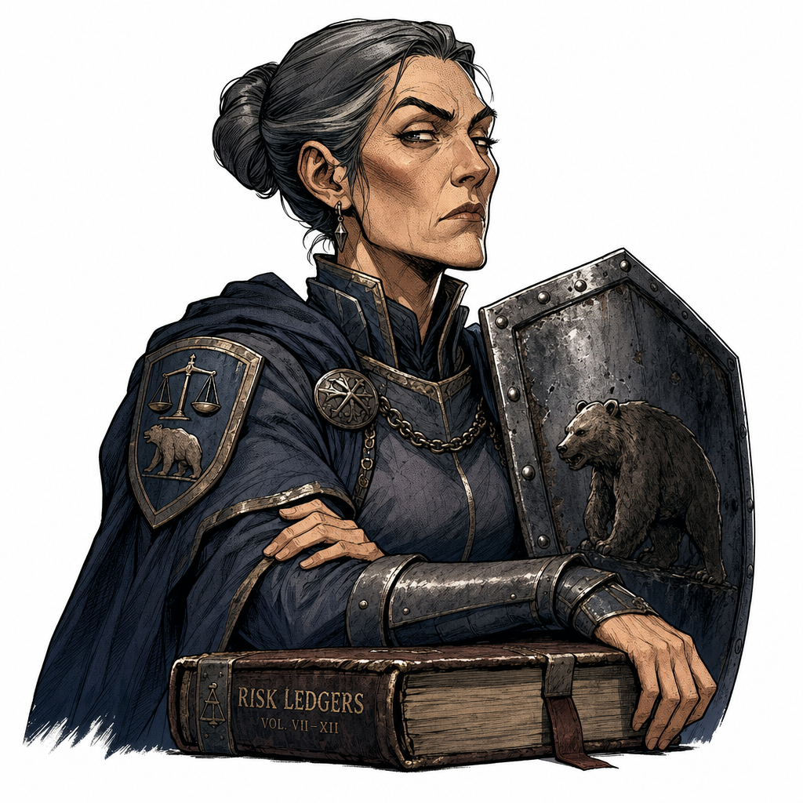
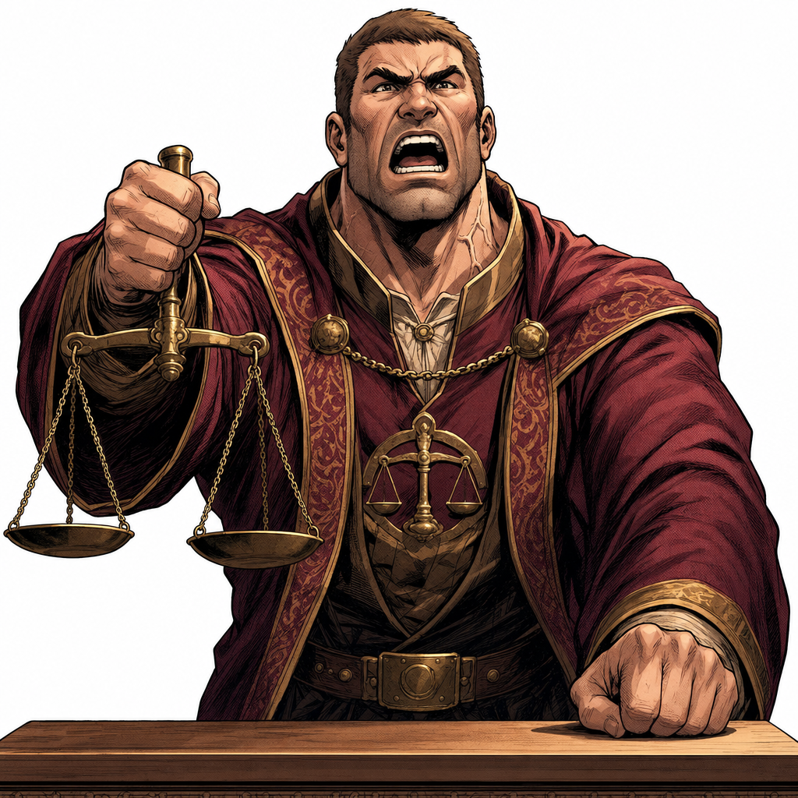

# Pokemon-Battle Debate View — Visual Design Spec

A SUPPLEMENT to DESIGN-SPEC.md. This document defines the 2-agent battle
debate view that replaces Section 3.1 (Hero Screen) during the DEBATE phase.
All DMG palette, typography, portrait-frame rules, and chrome conventions
are **inherited from DESIGN-SPEC.md** and NOT redefined here.

**Read this alongside** `DESIGN-SPEC.md` — the shared components (status
strip, sentiment bar, dialogue box chrome, portrait-frame system) are
defined there. This spec only covers what's NEW or DIFFERENT for the battle view.

---

## B.1 Battle View — When and Where

The battle view replaces Section 3.1 (single-speaker hero screen) during
the DEBATE phase of a round. The existing solo view (3.1) is still used
for analyst-report moments when one agent speaks alone. The switch happens
client-side: when the debate phase starts, the hero screen transitions into
the battle view.

```
┌──────────────────────────────────────────┐
│          DMG DEVICE BEZEL (outer)         │
│  ┌──────────────────────────────────────┐ │
│  │  SECTION 1: BATTLE VIEW              │ │   ← REPLACES 3.1 Hero Screen
│  │  (2-agent Pokemon-battle debate)     │ │       during DEBATE phase
│  │  ~580px tall                         │ │
│  └──────────────────────────────────────┘ │
│  ┌──────────────────────────────────────┐ │
│  │  SECTION 2: VS SPLASH                │ │   ← unchanged
│  └──────────────────────────────────────┘ │
│  ┌──────────────────────────────────────┐ │
│  │  SECTION 3: VERDICT BANNER           │ │   ← unchanged
│  └──────────────────────────────────────┘ │
└──────────────────────────────────────────┘
```

The outer bezel, status strip, VS splash, and verdict banner are
**unchanged** from DESIGN-SPEC.md. Only the hero screen section is
overloaded with the battle layout.

---

## B.2 Battle Arena — Full Layout (ASCII)

```
┌──────────────────────────────────────────────────────┐
│  STATUS STRIP (40px) — DESIGN-SPEC.md §3.1.1           │
│  ┌──────────┬─────────────────────┬──────────────────┐ │
│  │ AAPL     │  THE ROUND TABLE    │  TURN 4 / 12  🕯 │ │
│  └──────────┴─────────────────────┴──────────────────┘ │
├──────────────────────────────────────────────────────┤
│                                                      │
│  BATTLE ARENA (350px)  ← background: --dmg-dark      │
│                                                      │
│   ┌────────────────────┐       ┌──────────────────┐  │
│   │ MORWEN     🐻 BEAR │       │  ┌────────────┐  │  │
│   │ CONVICTION █████░░ │       │  │            │  │  │
│   │            82%     │       │  │  MORWEN    │  │  │
│   └────────────────────┘       │  │  (BEAR)    │  │  │
│              ▲                 │  │  250×250   │  │  │
│     stat box (upper-left)      │  │  painterly │  │  │
│                                │  │            │  │  │
│      ┌──────────────────┐      │  └────────────┘  │  │
│      │  ┌────────────┐  │      │  ═══ platform ══ │  │
│      │  │            │  │      └──────────────────┘  │
│      │  │ BALTHAZAR  │  │              ▲             │
│      │  │  (BULL)    │  │    portrait (upper-right)  │
│      │  │  250×250   │  │                            │
│      │  │  painterly │  │   ┌────────────────────┐   │
│      │  │            │  │   │ BALTHAZAR  🐂 BULL │   │
│      │  └────────────┘  │   │ CONVICTION █████░░ │   │
│      │  ═══ platform ══ │   │            78%     │   │
│      └──────────────────┘   └────────────────────┘   │
│              ▲                        ▲               │
│    portrait (lower-left)    stat box (lower-right)    │
│                                                      │
├──────────────────────────────────────────────────────┤
│  MOMENTUM BAR (28px) — DESIGN-SPEC.md §3.1.3          │
│  🐻 BEAR  ▓▓▓▓▓▓▓▓▓▓▓░░░░░░░░░  BULL 🐂              │
├──────────────────────────────────────────────────────┤
│  ⚡ MOVE FLOURISH (24px, optional)                     │
│  BALTHAZAR uses GROWTH THESIS!                       │
├──────────────────────────────────────────────────────┤
│  DIALOGUE BOX (144px) — DESIGN-SPEC.md §3.1.4         │
│  ┌──────────────────────────────────────────────────┐ │
│  │ BALTHAZAR (Bull)                                 │ │
│  │ ──────────────────────────────────────────────── │ │
│  │                                                  │ │
│  │ The MACD shows bullish momentum building          │ │
│  │ on the 4-hour. RSI confirms the breakout.         │ │
│  │                                                  │ │
│  │                                          ▼       │ │
│  └──────────────────────────────────────────────────┘ │
└──────────────────────────────────────────────────────┘
```

### B.2.1 Quadrant Pairing (The Pokemon Diagonal)

The battle arena places two agents in opposite quadrants — the classic
Pokemon battle layout where the opponent occupies the upper portion and the
player occupies the lower portion.

| Quadrant | Content | Role |
|----------|---------|------|
| Upper-left | Bear's stat box | Opponent info |
| Upper-right | Bear's portrait (Morwen) | Opponent sprite |
| Lower-left | Bull's portrait (Balthazar) | Player sprite |
| Lower-right | Bull's stat box | Player info |

This diagonal pairing means the portraits never occupy the same vertical
or horizontal band, giving each breathing room while keeping both visible.

---

## B.3 Battle Arena Container

The `.adv-battle-arena` is a new container inserted between the status
strip and the momentum bar (replacing the single-portrait area of §3.1.2).

```css
.adv-battle-arena {
  position: relative;
  width: 100%;
  height: 350px;
  background: var(--dmg-dark);           /* #306230 */
  border-left: 4px solid var(--dmg-darkest);
  border-right: 4px solid var(--dmg-darkest);
  overflow: hidden;                       /* portraits clip at edges */
}
```

- **Height:** 350px (fixed — must accommodate two 250px portraits on
  diagonal plus platforms)
- **Background:** `--dmg-dark` (#306230) — the darker green reads as
  the battle backdrop, distinct from the `--dmg-lightest` screen background
- **Borders:** Left/right only (4px dark), top/bottom borders come from
  the status strip and momentum bar respectively
- **No scanlines on the arena background** — the dark solid color keeps
  the painterly portraits readable

---

## B.4 Portrait Positioning (Two Agents)

### B.4.1 Morwen / BEAR — Upper-Right (Opponent Position)

Morwen appears in the upper-right area, the "wild Pokemon appeared" spot.

```css
.adv-battle-portrait-bear {
  position: absolute;
  top: 10px;
  right: 20px;
  z-index: 2;
}
```

- **Position:** `top: 10px; right: 20px` (anchored to upper-right corner)
- **z-index:** 2 (above the arena background, below the dialogue box)

### B.4.2 Balthazar / BULL — Lower-Left (Player Position)

Balthazar appears in the lower-left area, the "player's Pokemon" spot.

```css
.adv-battle-portrait-bull {
  position: absolute;
  bottom: 40px;   /* room for platform shelf */
  left: 20px;
  z-index: 2;
}
```

- **Position:** `bottom: 40px; left: 20px` (anchored to lower-left)
- **z-index:** 2 (same layer as Bear)
- The `bottom: 40px` leaves room for the platform shelf beneath

### B.4.3 Portrait Frame (shared)

Both portraits use the EXACT same frame rules as DESIGN-SPEC.md §3.1.2,
scaled down to 250px display size.

```css
.adv-battle-portrait-bear,
.adv-battle-portrait-bull {
  /* Shared portrait wrapper */
}

.adv-battle-frame {
  border: 12px solid var(--dmg-darkest);
  outline: 2px solid var(--dmg-mid);
  outline-offset: -14px;               /* sits inside the dark border */
  padding: 6px;
  background: var(--dmg-lightest);     /* safety fallback behind PNG */
  box-shadow: 4px 4px 0 var(--dmg-darkest);
  display: flex;
  align-items: center;
  justify-content: center;
}

.adv-battle-frame img {
  width: 250px;
  height: 250px;
  image-rendering: auto;               /* smooth, painterly — NO DMG filter */
  display: block;
  object-fit: cover;                   /* crop center if source isn't square */
}
```

| Property | Value | Source |
|----------|-------|--------|
| Outer border | 12px solid `--dmg-darkest` | §3.1.2 |
| Mid outline | 2px solid `--dmg-mid`, offset -14px | §3.1.2 |
| Inner matte | 6px padding with `--dmg-lightest` bg | §3.1.2 |
| Drop shadow | `4px 4px 0 var(--dmg-darkest)` | §3.1.2 |
| Image display | 250px × 250px | Scaled from 1024×1024 |
| Image rendering | `image-rendering: auto` (smooth) | §3.1.2 hard rule |

**Total framed element footprint:** 250px image + 12px border × 2 + 2px mid
× 2 + 6px matte × 2 = 290px × 290px (before `outline-offset` trick).

### B.4.4 Portrait Source Switching

The portraits switch between idle/speaking variants based on whose turn
it is:

| State | Bear (Morwen) | Bull (Balthazar) |
|-------|---------------|-------------------|
| Bull's turn (Balthazar speaks) | `morwen-idle.png` | `balthazar-speaking.png` |
| Bear's turn (Morwen speaks) | `morwen-speaking.png` | `balthazar-idle.png` |
| Both silent (transition) | Both idle | Both idle |

For the static mock, the frontend agent should pick one state (Bull's turn
is the default) and render accordingly. In production, this is driven by
the debate turn engine.

---

## B.5 Platform Shelves

Simple battle platforms beneath each portrait — like the ground platforms
in Pokemon battles. These are CSS-only elements.

```css
.adv-battle-platform {
  position: absolute;
  height: 10px;
  background: var(--dmg-darkest);
  border-top: 2px solid var(--dmg-mid);
  z-index: 1;
}
```

| Platform | Position | Width | Notes |
|----------|----------|-------|-------|
| Bear's platform | Directly under Bear's portrait | 280px (slightly wider than frame) | Anchored to Bear's frame bottom |
| Bull's platform | Directly under Bull's portrait | 280px | Anchored to Bull's frame bottom |

Platforms sit at `z-index: 1` (below portraits at `z-index: 2`) so the
frame rises from the platform.

### Implementation approach:

Each platform is a child of the portrait wrapper, positioned absolutely at
the bottom of the frame with a slight overhang:

```css
.adv-battle-platform {
  position: absolute;
  bottom: -2px;              /* slight overlap with frame bottom */
  left: 50%;
  transform: translateX(-50%);
  width: 270px;              /* ~10px narrower than frame on each side */
  height: 10px;
  background: var(--dmg-darkest);
  border-top: 2px solid var(--dmg-mid);
  border-left: 2px solid var(--dmg-darkest);
  border-right: 2px solid var(--dmg-darkest);
  z-index: 1;
}
```

The platform sits at `z-index: 1` so the frame's `z-index: 2` draws the
portrait on top of it — the platform appears to extend from beneath.

---

## B.6 HP-Style Stat Boxes

Small DMG-chrome boxes next to each agent, displaying conviction/"HP" and
allegiance. These are styled as mini dialogue-box-style panels.

### B.6.1 Bear Stat Box — Upper-Left

```css
.adv-battle-stats-bear {
  position: absolute;
  top: 14px;
  left: 16px;
  width: 195px;
  z-index: 3;
}
```

### B.6.2 Bull Stat Box — Lower-Right

```css
.adv-battle-stats-bull {
  position: absolute;
  bottom: 50px;              /* above the platform area */
  right: 16px;
  width: 195px;
  z-index: 3;
}
```

### B.6.3 Stat Box Inner Layout

```
┌────────────────────┐
│ MORWEN     🐻 BEAR │  ← name line (10px font)
│ ────────────────── │  ← divider (1px, --dmg-mid)
│ CONVICTION █████░░ │  ← HP-style gauge row
│            82%     │  ← percentage label
└────────────────────┘
```

| Element | Spec |
|---------|------|
| Name line | `--font-pixel`, 10px, `--dmg-lightest`. Left: character name ("MORWEN" or "BALTHAZAR"). Right: emoji + label (🐻 BEAR or 🐂 BULL) |
| Divider | 1px solid `--dmg-mid`, full width of padding box |
| Gauge label | "CONVICTION" in `--font-pixel`, 7px, `--dmg-mid` |
| Gauge track | 100% width, 10px tall, background `--dmg-darkest`, 2px border `--dmg-darkest` |
| Gauge fill | Left-to-right fill, `--dmg-mid` (#8BAC0F), width controlled by `--conviction-pct` |
| Percentage | `--font-pixel`, 8px, `--dmg-lightest`, right-aligned, shows the numeric conviction % |

### B.6.4 Stat Box Chrome (shared)

```css
.adv-battle-stats-bear,
.adv-battle-stats-bull {
  background: var(--dmg-dark);          /* #306230 */
  border: 3px solid var(--dmg-darkest);
  box-shadow: 3px 3px 0 var(--dmg-darkest);
  padding: 8px 10px;
  font-family: var(--font-pixel);
  color: var(--dmg-lightest);
}

.adv-battle-stats-name {
  display: flex;
  justify-content: space-between;
  align-items: baseline;
  font-size: 10px;
  line-height: 1.4;
  margin-bottom: 6px;
}

.adv-battle-stats-name span:first-child {
  text-transform: uppercase;
}

.adv-battle-stats-name .adv-battle-stats-allegiance {
  font-size: 8px;
  color: var(--dmg-lightest);
}

.adv-battle-stats-divider {
  height: 1px;
  background: var(--dmg-mid);
  margin-bottom: 6px;
}

.adv-battle-stats-gauge-label {
  font-size: 7px;
  color: var(--dmg-mid);
  text-transform: uppercase;
  margin-bottom: 4px;
}

.adv-battle-stats-gauge {
  height: 10px;
  background: var(--dmg-darkest);
  border: 1px solid var(--dmg-darkest);
  position: relative;
  margin-bottom: 4px;
}

.adv-battle-stats-gauge-fill {
  height: 100%;
  width: var(--conviction-pct, 50%);
  background: var(--dmg-mid);
  transition: width 0.4s steps(8);
}

.adv-battle-stats-pct {
  font-size: 8px;
  text-align: right;
}
```

### B.6.5 Conviction Gauge Values (static mock)

For the static HTML mock, use these conviction percentages:

| Agent | Conviction | `--conviction-pct` | Narrative |
|-------|-----------|-------------------|-----------|
| Morwen (Bear) | 82% | 82% | Bear is strongly convinced of downside risk |
| Balthazar (Bull) | 78% | 78% | Bull is confident in upside but slightly less than Bear |

In production, these values come from the debate engine and update turn by
turn. The percentage represents how strongly each agent holds their
position (bearish/bullish conviction), independent of the momentum bar.

---

## B.7 Active Speaker Emphasis

When it's an agent's turn to speak, the active agent gets visual emphasis
while the non-speaking agent recedes.

### B.7.1 Speaking Agent

Apply `.adv-battle-active` to the portrait wrapper of the agent whose
turn it is.

```css
.adv-battle-active .adv-battle-frame {
  transform: scale(1.05);
  filter: brightness(1.1);
  box-shadow:
    4px 4px 0 var(--dmg-darkest),
    0 0 12px var(--dmg-lightest);       /* subtle glow */
  transition:
    transform 0.35s ease-out,
    filter 0.35s ease-out,
    box-shadow 0.35s ease-out;
}

.adv-battle-active .adv-battle-frame img {
  animation: adv-battle-bob 2s ease-in-out infinite;
}
```

### B.7.2 Non-Speaking Agent

The non-speaking agent gets `.adv-battle-idle`:

```css
.adv-battle-idle .adv-battle-frame {
  opacity: 0.65;
  filter: brightness(0.85);
  transform: scale(0.97);
  box-shadow: 2px 2px 0 var(--dmg-darkest);  /* reduced shadow */
  transition:
    opacity 0.35s ease-out,
    filter 0.35s ease-out,
    transform 0.35s ease-out,
    box-shadow 0.35s ease-out;
}
```

### B.7.3 Bob Animation (speaking only)

A gentle vertical bob for the speaking agent's portrait:

```css
@keyframes adv-battle-bob {
  0%, 100% { transform: translateY(0); }
  50%      { transform: translateY(-4px); }
}
```

The bob is subtle — 4px up/down over 2 seconds. It animates the ``
inside the frame, NOT the frame itself (the frame stays stable).

### B.7.4 Turn Transition

When the turn switches from Bull to Bear (or vice versa):

1. Remove `.adv-battle-active` from the outgoing speaker
2. Add `.adv-battle-idle` to the outgoing speaker
3. Swap portrait sources (speaking → idle for outgoing; idle → speaking for
   incoming)
4. Remove `.adv-battle-idle` from the incoming speaker
5. Add `.adv-battle-active` to the incoming speaker
6. All transitions run at 350ms `ease-out`

The dialogue box clears and begins the new speaker's typewriter text
simultaneously.

---

## B.8 Momentum Bar (Reused Component)

The momentum bar is the EXACT same component as the sentiment bar from
DESIGN-SPEC.md §3.1.3. It sits between the battle arena and the move
flourish (or dialogue box if no flourish).

```css
.adv-battle-momentum {
  /* Identical structure to .adv-sentiment-bar from §3.1.3 */
  /* CSS custom property: --sentiment-pct */
}
```

- **Class:** `.adv-battle-momentum` wraps the same `.adv-sentiment-bar`
  markup
- **Behavior:** Identical — left = BEAR, right = BULL, gauge fills L→R
- **For the static mock:** Set `--sentiment-pct: 60%` (slight bull bias)
- **In battle context:** The momentum bar feels like the Pokemon battle
  HP bar — a tug-of-war that shifts with each argument

The task explicitly says this component is already defined and should
remain — this is just its placement in the battle view stack.

---

## B.9 Move Flourish (Optional Flavor)

A brief DMG-style banner that announces the current speaker's "move"
(Pokemon battle flavor). Appears between the momentum bar and the dialogue
box, visible for ~2 seconds at the start of each turn.

```
┌──────────────────────────────────────────────────────┐
│ ⚡ BALTHAZAR uses GROWTH THESIS!                      │
└──────────────────────────────────────────────────────┘
```

### B.9.1 Styling

```css
.adv-battle-move-flourish {
  width: 100%;
  max-width: 520px;
  margin: 0 auto;
  padding: 4px 16px;
  background: var(--dmg-darkest);       /* #0F380F — inverted from dialogue */
  font-family: var(--font-pixel);
  font-size: 8px;
  color: var(--dmg-lightest);           /* #9BBC0F */
  text-align: center;
  text-transform: uppercase;
  border: 2px solid var(--dmg-mid);
  opacity: 0;
  transform: translateY(-4px);
  transition: opacity 0.2s ease-out, transform 0.2s ease-out;
  pointer-events: none;
}

.adv-battle-move-flourish.adv-battle-move-show {
  opacity: 1;
  transform: translateY(0);
}
```

### B.9.2 Animation Sequence

1. Turn starts → move flourish appears (`.adv-battle-move-show` added)
2. Move flourish text: `"{SPEAKER} uses {MOVE}!"`
3. Display for 1800ms
4. Fade out (`.adv-battle-move-show` removed, 200ms transition)
5. 400ms pause
6. Dialogue box typewriter begins

### B.9.3 Move Names (for the static mock)

The frontend agent should use these sample moves:

| Speaker | Move Name |
|---------|-----------|
| Balthazar (Bull) | GROWTH THESIS |
| Morwen (Bear) | RISK EXPOSURE |
| Balthazar (Bull) | MOMENTUM SURGE |
| Morwen (Bear) | VOLATILITY SPIKE |
| Balthazar (Bull) | BULLISH DIVERGENCE |
| Morwen (Bear) | BEARISH CONFIRMATION |

In production, move names would be derived from the debate engine's
argument metadata. For the static mock, cycle through the first 3–4.

### B.9.4 Layout Impact

When the move flourish is present, the dialogue box gains 4px of
additional top-margin (24px gap instead of 16px from the momentum bar).
When the flourish fades out, the dialogue box retains its position — do
NOT shift the dialogue box up when the flourish disappears (prevents
layout jump). The flourish area collapses to `height: 0; overflow: hidden`
gracefully.

---

## B.10 Dialogue Box — Battle Variant

The dialogue box reuses the EXACT chrome from DESIGN-SPEC.md §3.1.4 with
two additions: speaker prefix and turn-by-turn cycling.

### B.10.1 Speaker Prefix

The speaker tag now includes both the character name AND the allegience
label:

```
BALTHAZAR (Bull):
```

vs the solo view's simpler format:

```
FLINT — Market Analyst
```

```css
.adv-dialogue-speaker {
  font-family: var(--font-pixel);
  font-size: 10px;
  color: var(--dmg-lightest);
  text-transform: uppercase;
  margin-bottom: 8px;
}

.adv-dialogue-speaker .adv-dialogue-allegiance {
  color: var(--dmg-mid);               /* #8BAC0F — de-emphasize allegiance */
  font-size: 9px;
}
```

Markup:

```html
<div class="adv-dialogue-speaker">
  BALTHAZAR <span class="adv-dialogue-allegiance">(Bull)</span>
</div>
```

### B.10.2 Turn Alternation

The dialogue alternates between Bull and Bear turn-by-turn:

| Turn | Speaker Prefix | Text Chunk |
|------|---------------|------------|
| 1 | BALTHAZAR (Bull) | "The MACD histogram shows bullish momentum building on the 4-hour..." |
| 2 | MORWEN (Bear) | "That momentum is a bull trap. Volume divergence on the daily..." |
| 3 | BALTHAZAR (Bull) | "Volume follows price, not the other way around. The RSI..." |
| 4 | MORWEN (Bear) | "RSI above 70 on a declining trend signals exhaustion..." |

### B.10.3 Typewriter Behavior (unchanged)

The typewriter animation, cursor blink, and advance indicator ▼ all work
identically to §3.1.4. The only change is the speaker tag content and the
turn cycling.

- Typing speed: 50ms/char
- Initial delay: 400ms after speaker tag appears (or 400ms after move
  flourish fades, if present)
- Cursor: Block █ in `--dmg-lightest`, 530ms/530ms blink
- Completion: 800ms after last char, then blinking ▼ (700ms/700ms)

### B.10.4 Dialogue Box Dimensions (unchanged)

- Width: 520px (centered)
- Height: 144px (fixed)
- Border: 4px solid `--dmg-darkest`, `inset 0 0 0 2px var(--dmg-mid)`
- Background: `--dmg-dark` (#306230)
- Box shadow: `4px 4px 0 var(--dmg-darkest)`

---

## B.11 CSS Class Namespace (Battle View)

All battle view classes use the `adv-battle-` prefix to distinguish from
existing `adv-` hero screen classes:

```
adv-battle-arena            — battle view container (replaces adv-hero internals)
  adv-battle-portrait-bear  — Morwen portrait wrapper (upper-right)
  adv-battle-portrait-bull  — Balthazar portrait wrapper (lower-left)
  adv-battle-frame          — shared portrait frame (same rules as adv-portrait-frame)
  adv-battle-platform       — platform shelf beneath each portrait
  adv-battle-stats-bear     — Bear stat box (upper-left)
  adv-battle-stats-bull     — Bull stat box (lower-right)
    adv-battle-stats-name
    adv-battle-stats-allegiance
    adv-battle-stats-divider
    adv-battle-stats-gauge-label
    adv-battle-stats-gauge
    adv-battle-stats-gauge-fill
    adv-battle-stats-pct
  adv-battle-active         — state class: this agent is speaking
  adv-battle-idle           — state class: this agent is listening
adv-battle-momentum         — momentum bar wrapper (reuses adv-sentiment-bar)
adv-battle-move-flourish    — optional move announcement
  adv-battle-move-show      — state class: flourish is visible
```

Existing classes reused without modification:
- `adv-status-strip`, `adv-status-ticker`, `adv-status-title`, `adv-status-turn`
- `adv-sentiment-bar`, `adv-sentiment-label`, `adv-sentiment-track`, `adv-sentiment-fill`
- `adv-dialogue-box`, `adv-dialogue-body`, `adv-dialogue-cursor`, `adv-dialogue-advance`
- `adv-vs-splash`, `adv-vs-slots`, `adv-vs-slot`, `adv-vs-divider`, `adv-vs-label`
- `adv-verdict-banner`, `adv-verdict-headline`, `adv-verdict-ruling`, `adv-verdict-prompt`

---

## B.12 Battle View Dimensions Summary

All dimensions in pixels. Desktop-first, with mobile overrides below.

| Element | Width | Height | Notes |
|---------|-------|--------|-------|
| Battle arena | 100% of content area | 350px | Fixed height, dark bg |
| Portrait image (each) | 250px | 250px | Scaled from 1024×1024 source |
| Framed portrait (each) | 290px | 290px | Image + 40px frame overhead |
| Stat box (each) | 195px | ~72px | Auto height based on content |
| Platform shelf (each) | 270px | 10px | Slightly narrower than frame |
| Momentum bar | 520px max | 28px | Reused from §3.1.3 |
| Move flourish | 520px max | 24px | Optional, collapses when hidden |
| Dialogue box | 520px | 144px | Reused from §3.1.4 |

### Vertical Stack (battle view inside Section 1)

```
Status strip                    40px    ← §3.1.1
Battle arena                   350px    ← NEW
Momentum bar                    28px    ← §3.1.3 (reused)
  (gap)                          4px    ← if move flourish present
Move flourish                   24px    ← NEW (optional, collapses to 0)
  (gap)                          4px    ← gap to dialogue
Dialogue box                   144px    ← §3.1.4 (reused)
─────────────────────────────────────
Total (battle view section)   ~594px
```

Without move flourish: ~566px. Both fit comfortably within the device.

---

## B.13 Active Speaker — Complete State Table

| State | Bear portrait | Bear stats | Bull portrait | Bull stats | Move flourish | Dialogue speaker |
|-------|---------------|------------|---------------|------------|---------------|------------------|
| Bull's turn | idle, dimmed | normal | speaking, active, bob | normal | "BALTHAZAR uses X!" | BALTHAZAR (Bull) |
| Bear's turn | speaking, active, bob | normal | idle, dimmed | normal | "MORWEN uses X!" | MORWEN (Bear) |
| Turn transition | switching to idle/speaking | updating | switching to idle/speaking | updating | fading out | clearing |

The stat boxes do NOT dim with their agent — they always display at full
opacity. Only the portrait frame and image are affected by active/idle state.

---

## B.14 Interaction Spec — Turn Progression

### B.14.1 Turn Flow

1. **Move flourish** appears (if implemented): `"{SPEAKER} uses {MOVE}!"`
   - Display 1800ms, fade 200ms
2. **Speaker emphasis** transitions: outgoing → idle, incoming → active
   - 350ms `ease-out` transition on all emphasis properties
3. **Portrait source** swaps: outgoing switches to idle PNG, incoming to
   speaking PNG
4. **Dialogue box** shows new speaker prefix
5. **Typewriter** begins: 400ms delay, then character-by-character reveal
6. **Advance indicator** ▼ blinks when typewriter completes
7. **Click/Tap advance** or auto-advance after 3s → triggers next turn
   (for the static mock, implement auto-advance with a `setTimeout`)

### B.14.2 Auto-Advance Timing (static mock)

```js
// Pseudocode for the frontend agent
const TURN_SEQUENCE = [
  { speaker: 'BALTHAZAR', allegiance: 'Bull', move: 'GROWTH THESIS', text: '...' },
  { speaker: 'MORWEN', allegiance: 'Bear', move: 'RISK EXPOSURE', text: '...' },
  { speaker: 'BALTHAZAR', allegiance: 'Bull', move: 'MOMENTUM SURGE', text: '...' },
  { speaker: 'MORWEN', allegiance: 'Bear', move: 'VOLATILITY SPIKE', text: '...' },
];

// After typewriter completes + advance blinks for 3s → next turn
// Total cycle: ~8-12 sec per turn
```

---

## B.15 Responsive / Mobile Behavior

### B.15.1 Tablet (640px–900px viewport)

Same as desktop. The 640px max-width device bezel already caps the layout.

### B.15.2 Mobile (< 640px viewport)

```css
@media (max-width: 640px) {
  .adv-battle-arena {
    height: 280px;                       /* shorter arena */
  }

  .adv-battle-frame img {
    width: 180px;
    height: 180px;                       /* smaller portraits */
  }

  /* Total framed: 180 + 40 = 220px */

  .adv-battle-portrait-bear {
    top: 8px;
    right: 8px;
  }

  .adv-battle-portrait-bull {
    bottom: 28px;
    left: 8px;
  }

  .adv-battle-stats-bear,
  .adv-battle-stats-bull {
    width: 150px;                        /* narrower stat boxes */
    font-size: 8px;                      /* smaller text */
  }

  .adv-battle-stats-bear {
    top: 8px;
    left: 8px;
  }

  .adv-battle-stats-bull {
    bottom: 36px;
    right: 8px;
  }

  .adv-battle-stats-name {
    font-size: 8px;
  }

  .adv-battle-stats-gauge-label {
    font-size: 6px;
  }

  .adv-battle-stats-pct {
    font-size: 7px;
  }

  .adv-battle-platform {
    width: 210px;
    height: 8px;
  }

  .adv-battle-move-flourish {
    font-size: 7px;
    padding: 3px 12px;
  }
}
```

At viewports under 360px, the diagonal layout may feel cramped. Accept
that the stat boxes will overlap slightly with portrait frames at extreme
small sizes — the Pokemon battle aesthetic already has overlapping elements.

---

## B.16 Animation Keyframes (New)

```css
/* Bob animation for active speaker portrait */
@keyframes adv-battle-bob {
  0%, 100% { transform: translateY(0); }
  50%      { transform: translateY(-4px); }
}

/* Reused from DESIGN-SPEC.md §8: */
/* @keyframes adv-cursor-blink — 530ms/530ms block cursor */
/* @keyframes adv-blink-slow  — 700ms/700ms advance indicator */
```

---

## B.17 PNG Asset Map (Battle View)

All paths relative to project root (`/Users/zachb/Desktop/TradingAgents/web-ui/frontend/the-bazaar/`).

| Slot | File | Dimensions | Notes |
|------|------|-----------|-------|
| Bear portrait (idle) | `design/comic-cast/morwen-idle.png` | 1024×1024 | Morwen listening |
| Bear portrait (speaking) | `design/comic-cast/morwen-speaking.png` | 1024×1024 | Morwen delivering argument |
| Bull portrait (idle) | `design/comic-cast/balthazar-idle.png` | 1024×1024 | Balthazar listening |
| Bull portrait (speaking) | `design/comic-cast/balthazar-speaking.png` | 1024×1024 | Balthazar delivering argument |

NOT used in the static battle mock (but available for production):
- `morwen-reacting.png`, `balthazar-reacting.png` — reaction expressions
  for post-argument beats

---

## B.18 Implementation Notes for Frontend Agent

### B.18.1 HTML Structure (battle view section)

```html
<!-- Inside .adv-mock-device, replacing the .adv-hero content -->
<section class="adv-hero adv-battle-view">
  <!-- Status strip (unchanged from existing) -->
  <div class="adv-status-strip">...</div>

  <!-- Battle arena -->
  <div class="adv-battle-arena">
    <!-- Bear's stat box (upper-left) -->
    <div class="adv-battle-stats-bear">
      <div class="adv-battle-stats-name">
        <span>MORWEN</span>
        <span class="adv-battle-stats-allegiance">🐻 BEAR</span>
      </div>
      <div class="adv-battle-stats-divider"></div>
      <div class="adv-battle-stats-gauge-label">CONVICTION</div>
      <div class="adv-battle-stats-gauge">
        <div class="adv-battle-stats-gauge-fill" style="--conviction-pct: 82%;"></div>
      </div>
      <div class="adv-battle-stats-pct">82%</div>
    </div>

    <!-- Bear's portrait (upper-right) -->
    <div class="adv-battle-portrait-bear adv-battle-idle">
      <div class="adv-battle-frame">
        
      </div>
      <div class="adv-battle-platform"></div>
    </div>

    <!-- Bull's portrait (lower-left) -->
    <div class="adv-battle-portrait-bull adv-battle-active">
      <div class="adv-battle-frame">
        
      </div>
      <div class="adv-battle-platform"></div>
    </div>

    <!-- Bull's stat box (lower-right) -->
    <div class="adv-battle-stats-bull">
      <div class="adv-battle-stats-name">
        <span>BALTHAZAR</span>
        <span class="adv-battle-stats-allegiance">🐂 BULL</span>
      </div>
      <div class="adv-battle-stats-divider"></div>
      <div class="adv-battle-stats-gauge-label">CONVICTION</div>
      <div class="adv-battle-stats-gauge">
        <div class="adv-battle-stats-gauge-fill" style="--conviction-pct: 78%;"></div>
      </div>
      <div class="adv-battle-stats-pct">78%</div>
    </div>
  </div>

  <!-- Momentum bar -->
  <div class="adv-battle-momentum">
    <div class="adv-sentiment-bar">
      <span class="adv-sentiment-label">🐻 BEAR</span>
      <div class="adv-sentiment-track">
        <div class="adv-sentiment-fill" style="--sentiment-pct: 60%;"></div>
      </div>
      <span class="adv-sentiment-label">🐂 BULL</span>
    </div>
  </div>

  <!-- Move flourish (present on turn start) -->
  <div class="adv-battle-move-flourish adv-battle-move-show">
    ⚡ BALTHAZAR uses GROWTH THESIS!
  </div>

  <!-- Dialogue box (battle variant) -->
  <div class="adv-dialogue-box">
    <div class="adv-dialogue-speaker">
      BALTHAZAR <span class="adv-dialogue-allegiance">(Bull)</span>
    </div>
    <div class="adv-dialogue-divider"></div>
    <div class="adv-dialogue-body adv-typing"></div>
    <div class="adv-dialogue-advance" style="display:none;">▼</div>
  </div>
</section>
```

### B.18.2 Key Constraints (from parent task)

- **`decoding="sync"`** on ALL portrait `` tags — required by the
  pipeline, not optional
- **NO port 8000** servers — serve from any other port or open the HTML
  file directly
- **Commit, do NOT push** — this is a sample for sign-off
- **Do NOT modify DESIGN-SPEC.md** — this is a supplementary spec
- **Do NOT modify index.html** — you are building a NEW battle view that
  sits alongside the existing hero screen, or replacing the hero section
  content in the static mock

### B.18.3 Build Target

The frontend agent should produce one of:
- A NEW `adv-mock-battle.html` file in the project root, OR
- Modify `design/adv-mock/index.html` to include the battle view as a
  second section (with a toggle or as a separate device)

**Preference:** `adv-mock-battle.html` (clean separation). The battle view
is a standalone sample for sign-off, not a modification of the existing
mock.

---

## B.19 Design Decisions & Rationale

1. **Diagonal quadrant layout.** Classic Pokemon battle positioning —
   opponent upper-right, player lower-left with info boxes in the
   complementary corners. This is instantly recognizable and gives each
   portrait breathing room within the 640px constraint.

2. **250px portrait size (vs 400px solo).** Two portraits split the
   vertical space. At 250px each with 40px frame overhead = 290px total,
   the combined height with overlap fits in 350px. The portraits are
   smaller than the solo view but still large enough to read expressions.

3. **Conviction gauge as HP bar.** The HP metaphor fits the Pokemon
   aesthetic perfectly. Each agent has their own conviction gauge (how
   strongly they hold their thesis) separate from the shared momentum bar
   (the tug-of-war). This gives visual depth — you can see WHO is more
   convinced AND which direction the debate is leaning.

4. **Active speaker emphasis with bob animation.** A subtle 4px bob +
   scale(1.05) + glow makes the active speaker feel "alive" without
   distracting from the dialogue text. The non-speaking agent dims to
   65% opacity — visible but clearly inactive.

5. **Move flourish as turn opener.** A Pokemon battle without "X uses Y!"
   feels incomplete. The DMG-darkest background with `--dmg-lightest` text
   creates an inverted banner that announces the turn. It's optional and
   can be disabled without breaking layout.

6. **Dialogue box speaker prefix format.** "BALTHAZAR (Bull)" vs the solo
   view's "FLINT — Market Analyst". The parenthetical allegiance label
   reinforces the Pokemon flavor (like "BALTHAZAR / Lv.42 🐂") while the
   character name in caps matches the DMG pixel-font convention.

7. **Reusing the momentum bar as-is.** The §3.1.3 sentiment bar is already
   an HP-style gauge. Reusing it without modification keeps the spec DRY
   and maintains visual consistency between the solo and battle views.

8. **Platform shelves beneath portraits.** A small CSS detail that sells
   the Pokemon aesthetic. The platforms are purely decorative but ground
   the portraits in the battle arena.

---

## B.20 UX Copy — All Battle View Text

### Stat Boxes

| Element | Text |
|---------|------|
| Bear name | MORWEN |
| Bear allegiance | 🐻 BEAR |
| Bear gauge label | CONVICTION |
| Bear percentage | 82% |
| Bull name | BALTHAZAR |
| Bull allegiance | 🐂 BULL |
| Bull gauge label | CONVICTION |
| Bull percentage | 78% |

### Momentum Bar

| Element | Text |
|---------|------|
| Left label | 🐻 BEAR |
| Right label | 🐂 BULL |

### Move Flourishes

| Turn | Text |
|------|------|
| Bull turn 1 | ⚡ BALTHAZAR uses GROWTH THESIS! |
| Bear turn 1 | ⚡ MORWEN uses RISK EXPOSURE! |
| Bull turn 2 | ⚡ BALTHAZAR uses MOMENTUM SURGE! |
| Bear turn 2 | ⚡ MORWEN uses VOLATILITY SPIKE! |
| Bull turn 3 | ⚡ BALTHAZAR uses BULLISH DIVERGENCE! |
| Bear turn 3 | ⚡ MORWEN uses BEARISH CONFIRMATION! |

### Dialogue Box Speaker Prefixes

| Turn | Speaker Tag |
|------|-------------|
| Bull's turn | BALTHAZAR (Bull) |
| Bear's turn | MORWEN (Bear) |

### Dialogue Body (sample text for static mock)

**Turn 1 — BALTHAZAR (Bull):**
"The MACD histogram shows bullish momentum building on the 4-hour. RSI confirms the breakout above 60 with rising volume."

**Turn 2 — MORWEN (Bear):**
"That momentum is a bull trap. Volume divergence on the daily timeframe suggests distribution, not accumulation."

**Turn 3 — BALTHAZAR (Bull):**
"Volume follows price, not the other way around. The RSI trendline break precedes every major rally this quarter."

**Turn 4 — MORWEN (Bear):**
"RSI above 70 on a declining trend signals exhaustion. The stochastic oscillator confirms overbought conditions."

### Advance Indicator

| Element | Text |
|---------|------|
| Advance prompt | ▼ _(blinking, after typewriter completes)_ |

---

## B.21 Accessibility Notes

- **Portrait alt text:** Each `` must have descriptive alt text
  identifying the character (e.g., "Morwen, the Risk Bear Debater")
- **Stat box contrast:** `--dmg-lightest` (#9BBC0F) on `--dmg-dark`
  (#306230) — contrast ratio ~7.3:1, exceeds WCAG AA 4.5:1
- **Gauge fill contrast:** `--dmg-mid` (#8BAC0F) on `--dmg-darkest`
  (#0F380F) — contrast ratio ~6.5:1, acceptable
- **Dialogue text:** 8px Press Start 2P on `--dmg-dark` passes for
  large text (the pixel font reads as display text at this size)
- **Focus indicators:** All interactive elements (advance click area)
  must have visible focus outlines in `--dmg-lightest`
- **Keyboard advance:** The dialogue advance (click to continue) should
  also respond to Enter/Space keypress
- **Motion reduction:** The bob animation and glow transitions should
  respect `prefers-reduced-motion: reduce`

```css
@media (prefers-reduced-motion: reduce) {
  .adv-battle-active .adv-battle-frame img {
    animation: none;
  }

  .adv-battle-active .adv-battle-frame,
  .adv-battle-idle .adv-battle-frame {
    transition: none;
  }
}
```

---

*Spec version: 1.0 | Date: 2026-06-02 | Author: UX Designer (web-dev-ux-designer)*
*Supplement to: DESIGN-SPEC.md v1.0*
*Next: Frontend agent reads this spec and builds `adv-mock-battle.html`*
